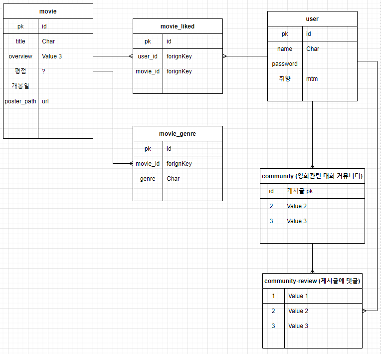

# Final Project

[TOC]

## 1. 목표

- 관리자 뷰
- 영화 정보 기반 추천 서비스 구성
  - 영화 평점 등록/ 수정/ 삭제
  - 평점을 등록한 유저는 해당 정보를 바탕으로 영화 추천
- 커뮤니티 서비스 구성
  - 영화와 관련된 대화 커뮤니티
  - 게시글에 댓글 작성
  - 각 게시글 및 댓글은 생성 및 수정 시각 정보 포함
- 추가 서비스 구성 (현재 상영중인 영화 + cgv, 메가박스 링크 포털)
- Django, JS, DB 활용한 ERD 구성 

## 2. 컨셉

영화 추천 => ...

## 3. 회의

1116

- 영화 추천 tab -> 평점을 한번도 등록을 안햇으면 => 등록해달라고 얘기만 하고

  영화 취향을 할때 => 별점, 추천을 하는지 안하는지 여부도 물어보면

  추천을 할 경우 => 비슷한 장르를 추천 tab에 보여주고

  아이디 생성 => 모든 장르값을 0 주고

  내 취향 버튼을 누를때마다 추가

  취향 취소하면 빼기

  ​	호러2 O

  ​	액션3 O

  ​	어밴저스 액션 호러 5 O

  ​	A 액션 판타지 4 O

  ​	=> 액션3, 호러2, 판타지 1

  sort 

  ​	 [0] => 추천 액션 영화 =>......

  (if) [1] => 추천 호러 영화 => ......

  (if) [2] => 추천 판타지 ...........................etc

1117

- 기본 프로젝트 골자 생성

- ERD 완성

- 각자 community, user 시작

- Back 과 Front를 절반씩 함께 헤쳐나가기로 결정

- community - 김동영

  user - 홍승영

  초반에 기본적인 골자(기본적인 CRUD + 로그인 등)를 해결하고 다시 회의하기로 결정

- 다시 생각해보니 기존에 컨셉을 정한 영화 추천 방법은 난항을 겪을 것이라는 결론

  일단 기본 골자를 만든 후 다시 생각해보기로 결정

초반에 생성한 기본 ERD

## 4. 자신이 한 일 기록하는 곳

1116 - 기본 회의만 진행 시간은 많으니까!

1117

​	승영 - 기본 골자 생성
